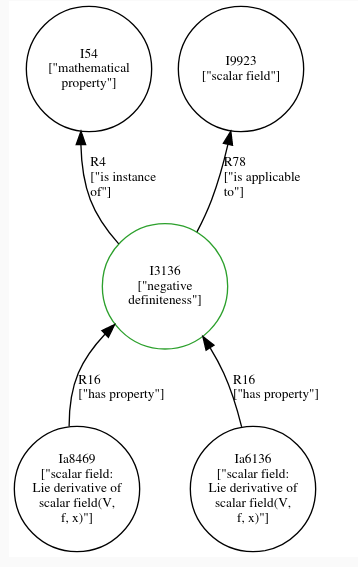

# General Information

Web frontend for [pyirk](https://github.com/ackrep-org/pyirk-core).

# Local Usage:

- Install [pyirk](https://github.com/ackrep-org/pyirk-core) (version >= 0.12) from suitable branch.
    - Recommended installation: clone the repo, then run `pip install -e .` within the repo
- Install pyerkdjago (this package):
    - clone the repo, enter the directory, then run:
    - `pip install -r requirements.txt`
    - `pip install -e .`
    - `python manage.py migrate`  (create the database)
    - `pytest` (make sure tests pass)
- Download data (e.g. [OCSE](https://github.com/ackrep-org/ocse))
- Explore the data:
    - enter the data-directory (where `irkpackage.toml` is located)
    - run `pyirk -dj`
        - this starts a local server for the webfrontend
        - can be stopped with CTRL-C
    - open <http://localhost:8000/reload>
    - use the search dialog to find entities of your interest via fuzzy search in labels and descriptions
    - append "/v" to the url to show a visualization of the relations to other entities like this:
        
    - click on the labels in the displayed graph to make this entity the center of a new graph
    - short links for ocse:
        - <http://localhost:8000/e/irk%253A%252Focse%252F0.2%252Fmath%2523I3133>
        - <http://localhost:8000/e/irk%253A%252Focse%252F0.2%252Fmath%2523I3133/v>
